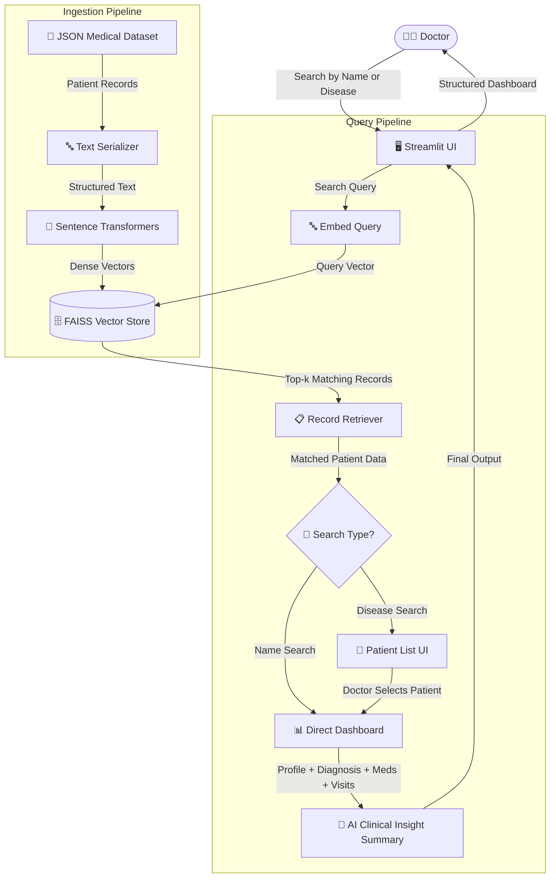
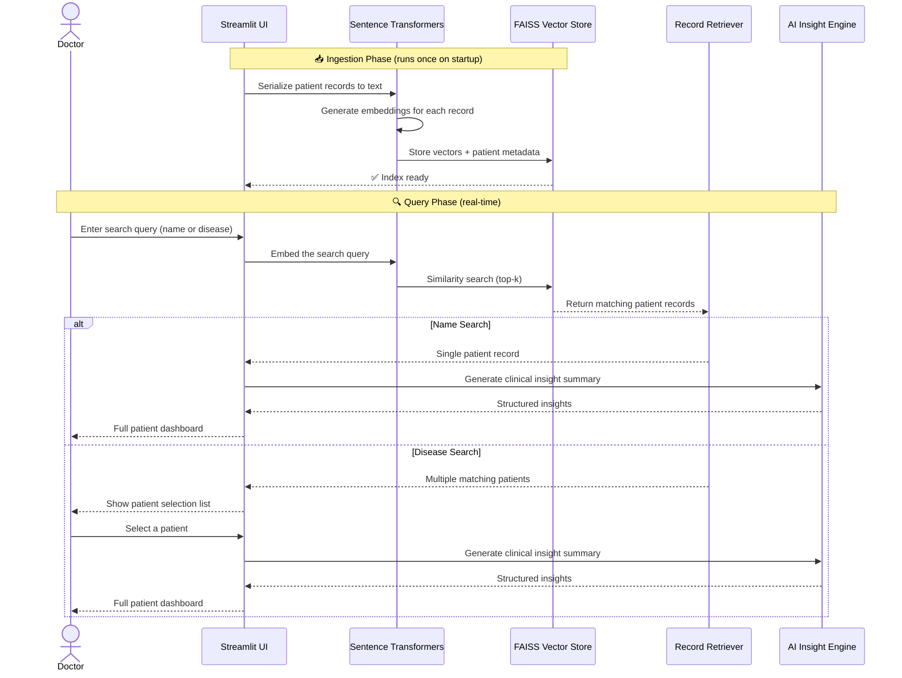

<div align="center">

# 🏥 ClinSight AI

### *Clinical Intelligence at the Speed of Thought*

[](https://www.python.org/)
[](https://streamlit.io/)
[](https://faiss.ai/)
[](https://sbert.net/)
[](LICENSE)

<br/>

> **ClinSight AI** is an AI-powered clinical intelligence platform that empowers doctors to instantly analyze patient case sheets and retrieve meaningful insights from medical records — using natural language. Powered by a **Retrieval-Augmented Generation (RAG)** pipeline with semantic search, ClinSight transforms unstructured patient data into structured, actionable clinical dashboards.

<br/>

</div>

---

## 📋 Table of Contents

- [🚨 Problem Statement](#-problem-statement)
- [💡 Solution Overview](#-solution-overview)
- [🏗️ System Architecture](#️-system-architecture)
- [🔄 RAG Pipeline Flow](#-how-the-rag-pipeline-works)
- [✨ Key Features](#-key-features)
- [🛠️ Tech Stack](#️-tech-stack)
- [⚡ Installation & Setup](#-installation--setup)
- [▶️ How to Run](#️-how-to-run)
- [💬 Example Queries](#-example-queries)
- [🚀 Future Improvements](#-future-improvements)
- [📄 License](#-license)

---

## 🚨 Problem Statement

In busy clinical environments, doctors routinely manage hundreds of patients — each with dense, unstructured medical histories buried in case sheets, visit logs, and diagnostic reports. Finding the right patient record or spotting a disease pattern across patients is:

- ⏱️ **Time-consuming** — manually scrolling through records wastes critical minutes
- 🔍 **Keyword-limited** — traditional search misses semantic context (e.g., searching "fatigue" won't surface "chronic tiredness")
- 🧩 **Fragmented** — patient data is scattered across diagnoses, prescriptions, and visit notes
- ⚠️ **Error-prone** — cognitive overload leads to missed patterns and oversights

> **There is no intelligent layer between the doctor and the data.**

---

## 💡 Solution Overview

**ClinSight AI** bridges this gap by introducing an AI-powered semantic search and retrieval layer over patient medical records. Doctors can query the system in plain English — by patient name or disease — and receive a fully structured clinical dashboard in seconds.

The platform leverages **Retrieval-Augmented Generation (RAG)**: patient records are embedded as semantic vectors, stored in a FAISS index, and retrieved using similarity search. When a disease is searched, the system surfaces all matching patients, lets the doctor select one, and renders a rich insight summary — no manual record hunting required.

---

## 🏗️ System Architecture



---

## 🔄 How the RAG Pipeline Works



### Step-by-Step Breakdown

| Step | What Happens |
|---|---|
| **1. Ingestion** | Patient JSON records are serialized into descriptive text strings |
| **2. Embedding** | Sentence Transformers convert each record into a high-dimensional semantic vector |
| **3. Indexing** | Vectors are stored in a FAISS index alongside patient metadata |
| **4. Query Embedding** | The doctor's search term is embedded using the same model |
| **5. Similarity Search** | FAISS retrieves the top-k most semantically similar patient records |
| **6. Branching Logic** | Name search → direct dashboard; Disease search → patient selection list |
| **7. Insight Generation** | AI summarizes the selected patient's clinical data into structured insights |
| **8. Dashboard Render** | Streamlit displays profile, diagnosis, medications, and visit history |

---

## ✨ Key Features

| Feature | Description |
|---|---|
| 🔍 **Semantic Search** | Search by patient name or disease using natural language — not just exact keywords |
| 🧠 **RAG Pipeline** | Retrieval-Augmented Generation grounds every insight in real patient data |
| 👥 **Multi-Patient Retrieval** | Disease queries return a ranked list of all matching patients to choose from |
| 📊 **Clinical Dashboard** | Structured view of patient profile, diagnosis, health issues, medications, and visit history |
| 💡 **AI Insight Summary** | Auto-generated clinical summary highlighting key patterns and concerns |
| 🗂️ **JSON Dataset Support** | Works directly with structured JSON medical record datasets |
| ⚡ **Real-Time Results** | Near-instant retrieval powered by FAISS approximate nearest-neighbor search |
| 🔒 **On-Device Processing** | All embeddings run locally — no patient data leaves your infrastructure |

---

## 🛠️ Tech Stack

| Layer | Technology | Purpose |
|---|---|---|
| **Frontend / UI** | [Streamlit](https://streamlit.io/) | Interactive clinical dashboard and search interface |
| **Embeddings** | [Sentence Transformers](https://sbert.net/) | Semantic vector representations (`all-MiniLM-L6-v2`) |
| **Vector Store** | [FAISS](https://faiss.ai/) | High-speed approximate nearest-neighbor similarity search |
| **Data Layer** | JSON Medical Datasets | Structured patient records (profile, diagnosis, medications, visits) |
| **Language** | Python 3.10+ | Core application runtime |

---

## ⚡ Installation & Setup

### Prerequisites

- Python **3.10** or higher
- `git` installed
- Your JSON medical dataset file

### 1. Clone the Repository

```bash
git clone https://github.com/your-username/clinsight-ai.git
cd clinsight-ai
```

### 2. Create a Virtual Environment

```bash
python -m venv venv

# macOS / Linux
source venv/bin/activate

# Windows
venv\Scripts\activate
```

### 3. Install Dependencies

```bash
pip install -r requirements.txt
```

### 4. Add Your Dataset

Place your JSON medical records file in the project root:

```
clinsight-ai/
└── data/
    └── patients.json     ← your dataset goes here
```

> 📌 See `data/sample_patients.json` for the expected record schema.

### 5. (Optional) Configure Settings

```bash
cp .env.example .env
```

Edit `.env` to set your dataset path or any custom configuration values.

---

## ▶️ How to Run

```bash
streamlit run app.py
```

The app will launch at **`http://localhost:8501`** in your browser.

### On First Launch

1. The system will automatically **ingest and index** all patient records from your JSON dataset
2. Embeddings are generated once and cached for subsequent runs
3. The search interface becomes available as soon as indexing is complete

---

## 💬 Example Queries

Once the app is running, try these searches in the query box:

```
👤 Patient Name Search
→ "Arjun Sharma"
→ "Priya Mehta"

Returns: Direct patient dashboard with full profile, diagnosis,
         medications, and AI clinical insights.

🦠 Disease / Symptom Search
→ "fatigue"
→ "Type 2 Diabetes"
→ "hypertension"
→ "chest pain"

Returns: A list of all patients matching that condition.
         Select a patient to view their detailed clinical dashboard.

🔬 Complex Symptom Search
→ "fatigue history with iron deficiency"
→ "recurring headaches and high BP"

Returns: Semantically matched patients — even if the exact
         words don't appear in the record.
```

---

## 📁 Project Structure

```
clinsight-ai/
│
├── app.py                  # Streamlit UI — search interface and dashboard rendering
├── rag_pipeline.py         # RAG logic — ingestion, embedding, FAISS indexing, retrieval
├── insight_engine.py       # AI clinical insight summary generation
├── data/
│   ├── patients.json       # Your medical records dataset
│   └── sample_patients.json# Example schema for reference
├── requirements.txt        # Python dependencies
├── .env.example            # Environment variable template
├── .gitignore              # Git ignore rules
└── README.md               # Project documentation
```

### Key Files

**`app.py`** — Manages the Streamlit interface: search bar, branching logic for name vs. disease queries, patient selection list, and dashboard rendering.

**`rag_pipeline.py`** — Core RAG logic: JSON loading, text serialization, Sentence Transformer embedding, FAISS index creation, and semantic similarity retrieval.

**`insight_engine.py`** — Takes retrieved patient records and produces structured AI clinical summaries highlighting diagnosis, medications, and notable patterns.

---

## 🚀 Future Improvements

- [ ] 🧾 **PDF Case Sheet Upload** — Ingest scanned or digital PDF patient documents directly
- [ ] 🌐 **Multi-language Support** — Embed and search records in Hindi, Tamil, and other regional languages
- [ ] 📈 **Health Trend Visualization** — Charts for vitals, lab values, and visit frequency over time
- [ ] 🔐 **Role-Based Access Control** — Separate doctor, nurse, and admin access levels
- [ ] ☁️ **Persistent FAISS Index** — Save and reload the vector index across sessions without re-ingestion
- [ ] 📊 **Confidence Scores** — Show retrieval relevance scores alongside each search result
- [ ] 🔔 **Critical Alert Flags** — Auto-surface high-risk patients based on vitals or drug interactions
- [ ] 🐳 **Docker Deployment** — One-command containerized setup for hospital IT environments
- [ ] 🧪 **RAGAS Evaluation** — Faithfulness and relevance scoring for retrieved insights
- [ ] 🔄 **Streaming Summaries** — Token-by-token streaming for faster perceived insight generation

---

## 📄 License

This project is licensed under the **MIT License** — see the [LICENSE](LICENSE) file for details.

---

<div align="center">

**Built with ❤️ to make clinical intelligence accessible to every doctor.**

*If ClinSight AI helps your workflow, consider giving it a ⭐ — it helps others discover the project!*

[](https://github.com/your-username)
[](https://linkedin.com/in/your-profile)

</div>
